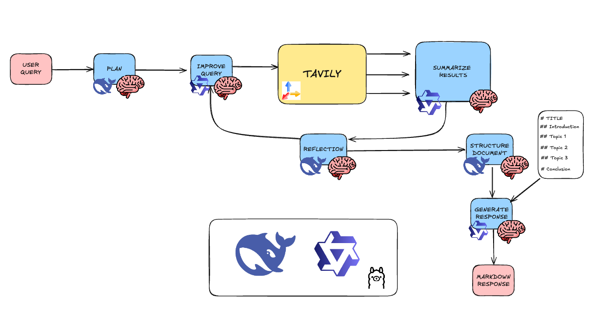

# Deep JS Research 🧠

Una alternativa open source a DeepResearch de OpenAI (200$/mes) que permite investigar cualquier tema y generar documentos de investigación con datos factuales. El proyecto utiliza LangChain y LangGraph junto con modelos LLM de código abierto:
- **DeepSeek R1 (8b)**: Para el análisis y planificación
- **Qwen 2.5 (7b)**: Para la generación de contenido
- **Tavily API**: Para búsquedas web eficientes y extracción de contenido

Un sistema avanzado de investigación impulsado por IA que utiliza modelos de lenguaje y búsqueda web para generar documentos de investigación detallados y bien estructurados.

## 🌟 Características

- **Investigación Automatizada**: Genera documentos de investigación completos a partir de una simple consulta
- **Búsqueda Inteligente**: Utiliza Tavily API para búsquedas web precisas y relevantes
- **Análisis de Brechas**: Identifica y llena automáticamente vacíos de información
- **Procesamiento Iterativo**: Mejora continuamente el contenido mediante múltiples ciclos de análisis
- **Interfaz en Tiempo Real**: Muestra el progreso de la investigación en tiempo real
- **Documentos Estructurados**: Genera documentos académicos bien organizados en formato Markdown

## 🏗️ Arquitectura

### Frontend (Next.js + TypeScript)

- **Framework**: Next.js 15.1.7 con TypeScript
- **UI**: Diseño moderno con Tailwind CSS
- **Componentes Principales**:
  - `ConceptInput`: Entrada de consulta de investigación
  - `ThinkingProcess`: Visualización del proceso en tiempo real
  - `ResultDisplay`: Presentación del documento final
  - `SourcesList`: Lista de fuentes consultadas
- **WebSocket**: Comunicación en tiempo real con el backend

### Backend (Node.js + TypeScript)

- **Framework**: Express.js con TypeScript
- **Características Principales**:
  - WebSocket Server para actualizaciones en tiempo real
  - Sistema de procesamiento basado en grafos
  - Integración con múltiples APIs de IA

#### Cerebros de IA



1. **PlanResearchBrain**: 
   - Optimiza la consulta de investigación

2. **TavilySearchTool**:
   - Realiza búsquedas web precisas
   - Recopila información relevante

3. **SummarizeContentBrain**:
   - Genera resúmenes coherentes
   - Integra nueva información con contenido existente

4. **AnalyzeGapsBrain**:
   - Identifica brechas de conocimiento
   - Genera consultas de seguimiento

5. **GenerateStructureBrain**:
   - Crea estructuras de documentos jerárquicas
   - Organiza el contenido lógicamente

6. **GenerateDocumentBrain**:
   - Produce documentos académicos completos
   - Aplica estándares de escritura académica

## 🔄 Flujo de Trabajo

1. **Planificación**:
   - El usuario ingresa una consulta de investigación
   - El sistema genera un plan de búsqueda optimizado

2. **Búsqueda y Análisis**:
   - Búsqueda web mediante Tavily API
   - Generación de resúmenes del contenido encontrado
   - Análisis de brechas de conocimiento
   - Búsquedas adicionales según sea necesario

3. **Generación de Documentos**:
   - Creación de estructura jerárquica
   - Generación de contenido detallado
   - Formateo en Markdown académico

## 🛠️ Tecnologías

### Frontend
- Next.js 15.1.7
- React 19.0.0
- TypeScript
- Tailwind CSS
- React Markdown
- WebSocket Client

### Backend
- Node.js
- Express
- TypeScript
- LangChain
- Ollama
- Tavily API
- WebSocket Server

## 🚀 Configuración

### Requisitos Previos
- Node.js (versión LTS)
- Ollama instalado y ejecutándose localmente
- Clave API de Tavily

### Variables de Entorno

#### Frontend
```env
NEXT_PUBLIC_WS_URL=ws://localhost:5000
```

#### Backend
```env
PORT=5000
NODE_ENV=development
API_PREFIX=/api/v1
OLLAMA_BASE_URL=http://localhost:11434
TAVILY_API_KEY=your_tavily_api_key_here
GENERATION_MODEL=qwen2.5:7b
THINKING_MODEL=deepseek-r1:8b
MAX_ANALYSIS_COUNT=2
MAX_RESULTS=1
```

### Instalación

1. **Backend**
```bash
cd backend
npm install
npm run dev
```

2. **Frontend**
```bash
cd frontend
npm install
npm run dev
```

## 📚 Uso

1. Accede a la aplicación web (por defecto en http://localhost:3000)
2. Ingresa tu consulta de investigación en el campo de entrada
3. El sistema comenzará automáticamente el proceso de investigación
4. Observa el progreso en tiempo real
5. Recibe el documento final en formato Markdown

## 🤝 Contribución

Las contribuciones son bienvenidas. Por favor, sigue estos pasos:

1. Fork el repositorio
2. Crea una rama para tu feature (`git checkout -b feature/AmazingFeature`)
3. Commit tus cambios (`git commit -m 'Add some AmazingFeature'`)
4. Push a la rama (`git push origin feature/AmazingFeature`)
5. Abre un Pull Request

## 📄 Licencia

Este proyecto está bajo la licencia ISC. Ver el archivo `LICENSE` para más detalles.

## 🙏 Agradecimientos

- [Tavily API](https://tavily.com) por el motor de búsqueda
- [Ollama](https://ollama.ai) por los modelos de IA locales
- [LangChain](https://js.langchain.com) por el framework de IA 